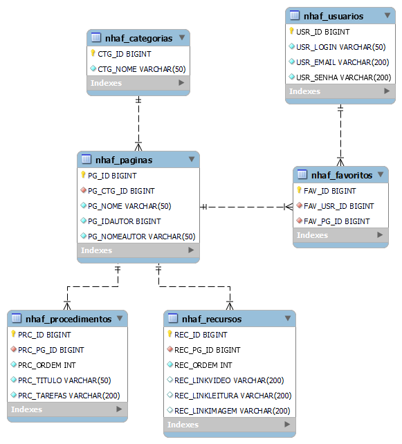

# fiap-grupoj-fase1
Repositório para a atividade da Fase 1 (entrega 3) do Grupo J da FIAP.

## Sobre a atividade
A atividade realizada neste repositório é a de criar uma base de dados relacional para armazenar os registros que futuramente serão manipulados pela aplicação cujo protótipo está sendo devolvido agora. Juntamente com a base de dados, deve ser criada uma camada de persistência de dados em Java usando JPA. Por hora, pode ser criada uma estrutura/classe para testar os métodos de persistência de dados. Podem ser usados ainda os bancos de dados relacionais Oracle, MySQL ou Postgres, em suas versões mais recentes, preferencialmente.

## Detalhes do projeto
O projeto é de uma aplicação para ajudar com tarefas corriqueiras. Usuários poderão criar páginas para deixar suas dicas e tutoriais sobre assuntos que os interessem. Também poderão separar estas páginas em categorias, para organizá-las. Dentro dessas páginas poderão haver tanto texto (os "procedimentos") quanto links para imagens, outros textos e vídeos (os "recursos").

Neste projeto, estamos usando Java 17, Maven, JPA e banco de dados MySQL. O schema do banco (que está com o nome provisório da aplicação de "Need Help App") se encontra abaixo:

  

### Sobre as classes

No projeto, existem seis entidades (localizadas em "src/main/java/br/com/fiap/needhelpapp/model"):
- "Usuario": são as pessoas cadastradas. Cada usuário tem seu nome (login), email e senha.
- "Favorito": são as páginas favoritadas pelo usuário.
- "Categoria": são os agregadores de páginas, os assuntos sob os quais as páginas estão organizados. Exemplo: receitas, roupas, dicas imperdíveis, etc.
- "Pagina": são a parte mais importante da aplicação. É nas páginas que se localizam os textos e recursos, que são o principal foco da aplicação. Páginas pertencem a Categorias, e elas agregam Procedimentos e Recursos. Além disso, também possuem um autor (um usuário), e devem permanecer mesmo após a exclusão de seu autor.
- "Procedimento": são os textos de cada secção de uma página. Devido à natureza diversa da aplicação, tanto o nome do procedimento quanto seu conteúdo fica a cargo do autor. Também por este motivo, é salva no banco a ordem em que os procedimentos devem aparecer na página.
- "Recursos": links a serem atrelados a uma página. Usuários podem incluir links de imagens, vídeos e leituras para sere adicionados as suas páginas. Estes, assim como os procedimentos também possuem uma ordem de aparição.

Cada um dos objetos descritos acima possui uma classe DAO que herda de uma GenericDAO, localizadas em "src/main/java/br/com/fiap/dao".

Foi criada também uma classe de enums para conveniência e organização (além de futuro uso, caso o projeto cresça e seja usado futuramente). Ela está localizada em "src/main/java/br/com/fiap/utils".

## Como rodar o projeto
Na pasta "dbScripts", exitem alguns scripts MySQL para criação do banco que será usado. Basta rodá-los em ordem de acordo com os índices em seus nomes e será criado o banco de dados inicial para os testes. 
Em seguida, no arquivo persistence.xml ("fiap-grupoj-fase1/src/main/java/META-INF/"), preencha as credenciais de usuário e senha para o banco local a ser usado. 
Por fim, para realizar os testes de persistência, rode os arquivos Java localizados em "fiap-grupoj-fase1/src/main/java/br/com/fiap/needhelpapp/tests/".  
Boa sorte e bons testes.

  

